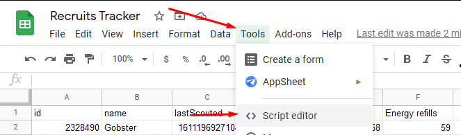
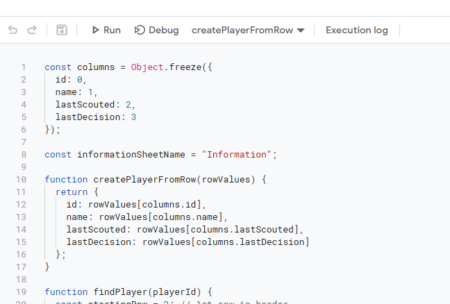
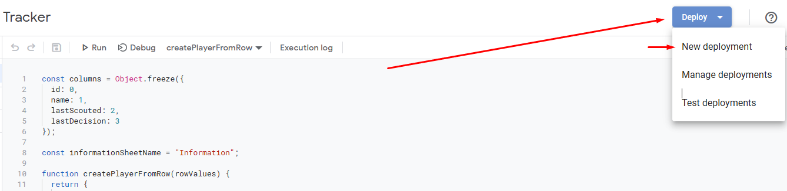
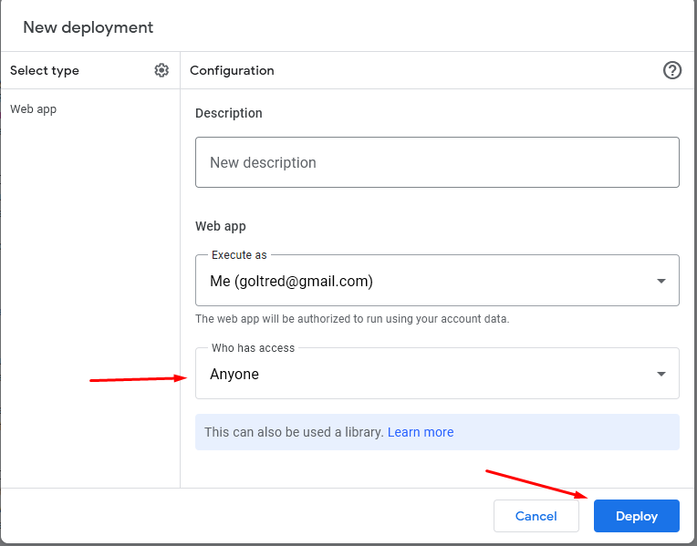
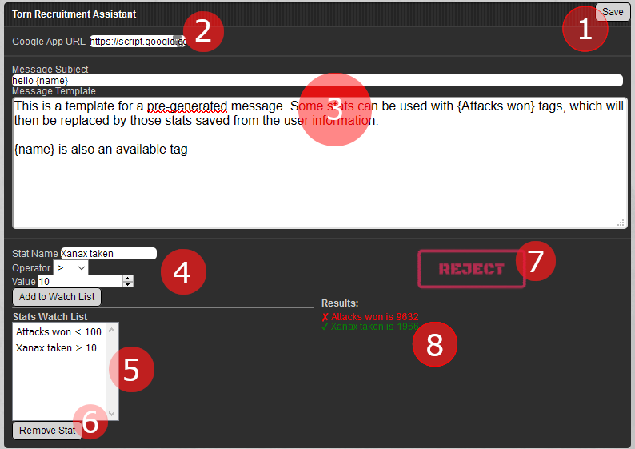
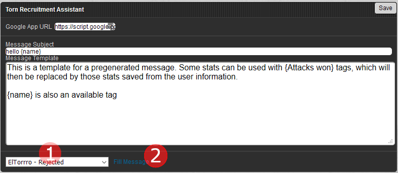

# Torn Recruit Assistant and Tracker

This script's purpose is to help you quickly assess if a player meets your requirements/criteria for them to join your
faction while keeping track of potential recruits, rejects and people who has already been messaged.

The userscript sends information to a Google App which is able to record player information into a sheet, and then be 
updated by subsequent visits to the player.

## Userscript Data

The userscript sends information to a web application as a JSON object. The JSON object that is sent has the following format:
```
## Structure sent to web app
{
  id: number,
  name: string,
  lastDecision: string,
  lastScouted: number
  <stat name as shown in torn UI>: <processed value>
}
```

For flexibility purposes, all information readable in the `personalstats` webpage of a player is sent to the web application
in the form of key:value pairs, with the key being the name of the stat as it appears in Torn, and the value being processed as follows:

Numerical values: Cleared thousands separator (,)
Currency values: Cleared thousands separator (,) and dollar sign ($)
Values with percentage stat (e.g. Hits, Critical Hits): Cleared thousands separator and removed percentage stat
Others (-- or formatted time): As shown

## Setting up the Web App

1. To setup a web app for this script, just create a new sheet and then go to Tools -> Script Editor.

1. This will open a new window, where you can write code. The code is supplied in the [recruitAPI.gs](recruitAPI.gs) file

1. After the code is there, click the `Deploy` button on the top right 

1. Fill the details on the deployment windows as you see fit, making sure to:
* Type of application is **Web App**
* Set the permissions of the application to **Anyone**


After this point, you should receive a URL, this is the URL for your web application and **needs** to be provided in 
the userscript settings.

### Setting up the sheet

For data to be saved, a sheet named `Information` needs to exist. Inside this sheet the first row is used for searching
the column where different values need to be saved, with the first `5` rows reserved for script functionality.

The first 5 columns need to be:
1. id
1. name
1. lastScouted
1. lastDecision
1. lastSeenBy

From column 6 you can start setting up the columns you want to save to your sheet. The text should **exactly** match the
name of the stat in the `personalstats.php` page, otherwise stats will not be able to be mapped properly.

As an example, the following sheet tracks the `Attacks won`, `Energy refills`, `Xanax taken`, `Fraud` (crimes) 
and `Total respect` for users scouted with the script. 


## Using the script

### In Personal Stats page

Once the script has been installed, the following UI should appear whenever you open the personal stats page of any player
in Torn:



Numbered elements are:
1. Save changes button
1. Google Application URL where data will be sent
1. Message and Subject template that will be used for filling the message
1. Controls to add a specific stat to the Stats Watch list
1. Current Stats Watch list
1. Button to remove selected stat from the Stats Watch list
1. Decision visual indicator. Clicking on this button will bring you to the `Messages` page
1. Comparison Results

#### Process

The current process the script executes the following once the page finishes loading:

1. Query the Google Sheet App to validate if this player has already been messaged or not. If the application states 
that it has been messaged, then it will show a `Messaged` image in the `Decision Visual Indicator` section.
1. It will go over any stat added to the Stats Watch list and look for the corresponding value on the player's stats
1. If ALL requirements are met, one of two decisions are displayed:
    1. Reject: The player does not meet your criteria
    1. Recruit: The player meets your criteria
1. Once a decision is shown, the script will send data to the web application with the player information and the 
current decision
1. A summary of compared stats will be displayed under the `Decision Visual Indicator` for quick reference into which 
criteria was met or not
1. A reference to this player is saved on the script's local storage. That way, when going back to the messages page,
the reference to the player will be used to prefill a message while the script retrieves user information from the
Google Sheet App

### In Messages page

The messages page gives you controls to fill a message based on your template and the selected user. This UI queries the
google sheet application for any player that has been flagged as "Recruitable" or "Rejected" so that you can decide who
to send a message to.


 
Some of the same controls are in this page too, with a couple of new additions:

1. Dropdown box for user selection
1. `Fill Message` button to create the message with the template, subject and player data

#### Process

Once the `Messages` page loads:

1. The dropdown (1) will be populated with the last seen user in the script's local storage
1. The script will query the Google Sheet App to retrieve those records that have a status of `Rejected` or `Recruitable`.
 Once the request returns with returns, the dropdown (1) will be updated to include the results
1. When the `Fill Message` (2) button is clicked, the script will fill out the message controls based on the following:
    1. `Message Subject` value will be processed and copied to `Subject`
    1. `Message Template` value will be processed and copied to the message body
    
##### Message processing

When filling out the message form, some processing is done in the templates to ensure that some tags can be replaced with
user information. This information is taken from the Google Sheet App (or the last reference to the player), and as such
it is important to setup the Google Sheet App with the data that you think its important for your recruitment process.

For the replacement process to work, tags can be used in the format of `{stat}` in either the Message Subject or 
Message template fields.

The following tags are able to be used:
* {name}
* {id}
* {player stat as it appears in the personal stats page}

 As an example, if you wanted to create a message that includes the number of attacks a player won, then the following 
 template could be used:
 
 `This is a templated message for {Attacks won} attacks won for {name}`
 
 The above template for a player named `Hello` with 2000 Attacks won on their belt would look like:
 
 `This is a templated message for 2000 attacks won for Hello`