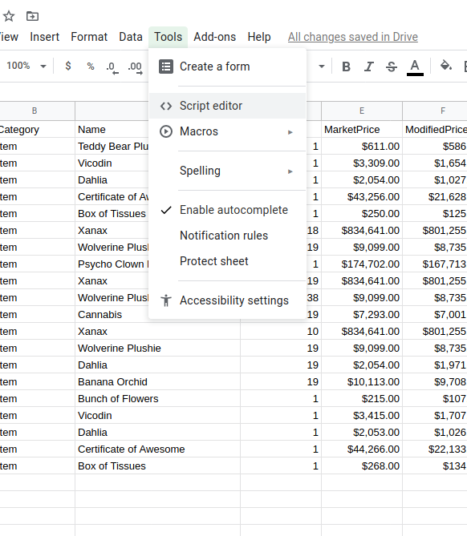
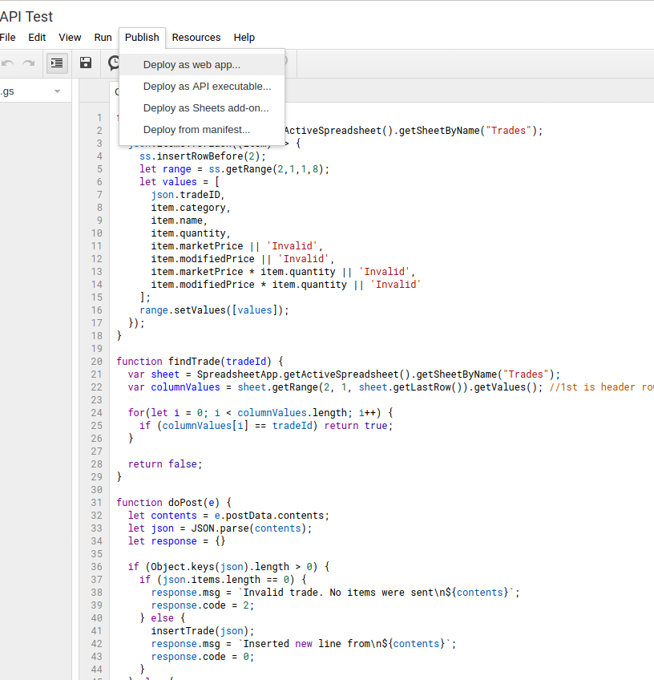
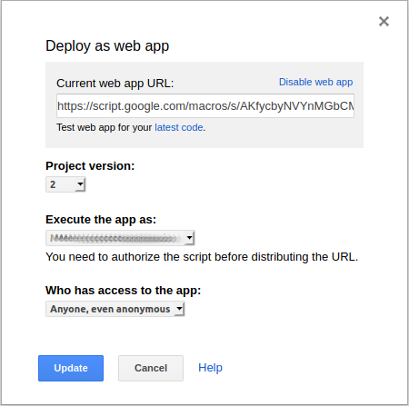
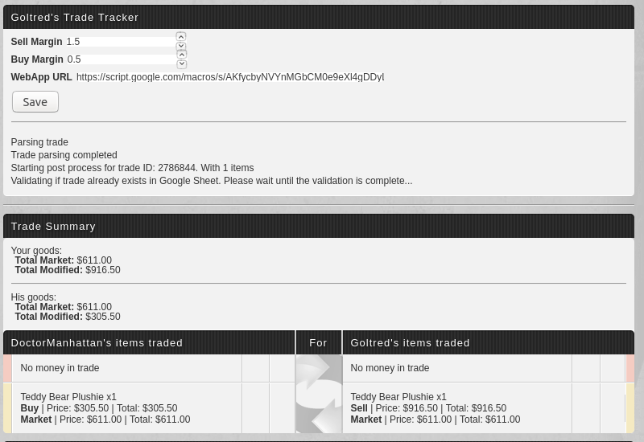

# Torn Trade Tracker

This script help you keep track of previous trades, sending information to a published Google Web App which would then 
record data into a Google Sheet.

The tracking feature works for completed trades. For it to trigger, you need to go to any past trades so that the script
can parse the body of the page, get the items from it and then send the information to the sheet.

At the same time, the script adds a couple of new elements to active and past trades, allowing you to establish
"margin" values for buying and selling items, as well as appending the market price of products added to the trade.

The script also adds some new elements to be able to change the parameters of the feature and saves preferences to the
script local storage.

**This script requires your API key** to perform 1 call to the Torn API and fetch the list of items.

## Userscript Data

The userscript sends information to a web application as a JSON object. The JSON object that is sent has the following format:
```
## Structure sent to web app
{
  tradeID: number,
  items: Array of item - see definition of item below
}

## Array of Items
{
  category: string, // For future use
  name: string, // Display name of the item
  quantity: number,
  marketPrice: number, // Market price of the item
  modifiedPrice: number, // Market price * margin value
  totalMarketPrice: number, // marketPrice * quantity
  totalModifiedPrice: number // modifiedPrice * quantity
}
```

## Setting up the Web App

1. To setup a web app for this script, just create a new sheet and then go to Tools -> Script Editor.

1. This will open a new window, where you can write code. Some base code has been provided in the tracker-sheet.js file
but this is where you would modify what your web application takes from the user script and how it inserts data into the
sheet.

1. After the code is there, go to Publish -> Deploy as web app and set the following settings:
    1. Project Version: Irrelevant
    1. Execute the app as: **Me (<your email>)**
    1. Who has access to the app: **Anyone, even anonymous**


After this point, you should receive a URL, this is the URL for your web application and **needs** to be provided in 
the userscript settings

## Using the userscript

Once you have installed the userscript with your faqvorite manager, you should see the following as "UI" on any trade



The settings controls allows you to change the margin modifiers of your trade as well as the URL to your google web app.
Clicking save commits the changes to the script local storage.

The controls also include a section where script output is printed, to present the user with some output in special
scenarios.

When looking at past trades, the script will:
1. Parse the items bought and the trade ID
1. Make a request to the web app to validate if that trade has already been processed or not (this avoids multiple
entries for the same trade)
1. If the trade does not exist, it sends a second request with the trade information for processing 

As this process is executed, messages are sent to the UI as a means of providing feedback to the user.

## Known Issues

* The trade page sometimes throws a jquery exception which prevents scripts from executing reliably. a page refresh once 
a trade is loaded should work around this problem.
* The script currently looks only at items of a trade and disregards anything else 
